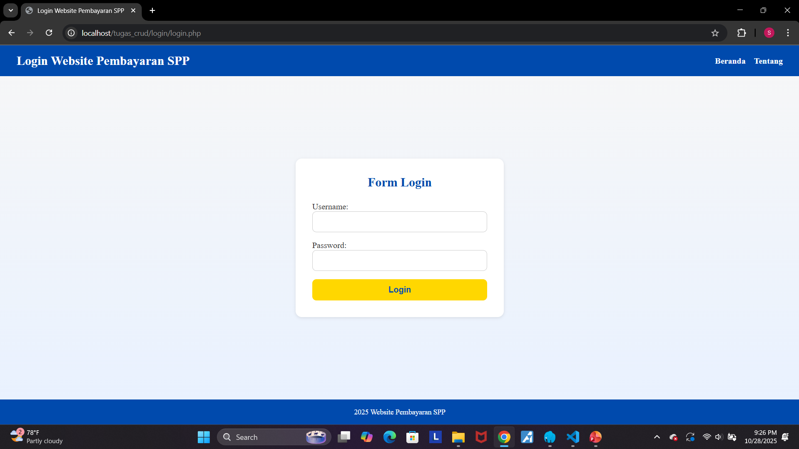
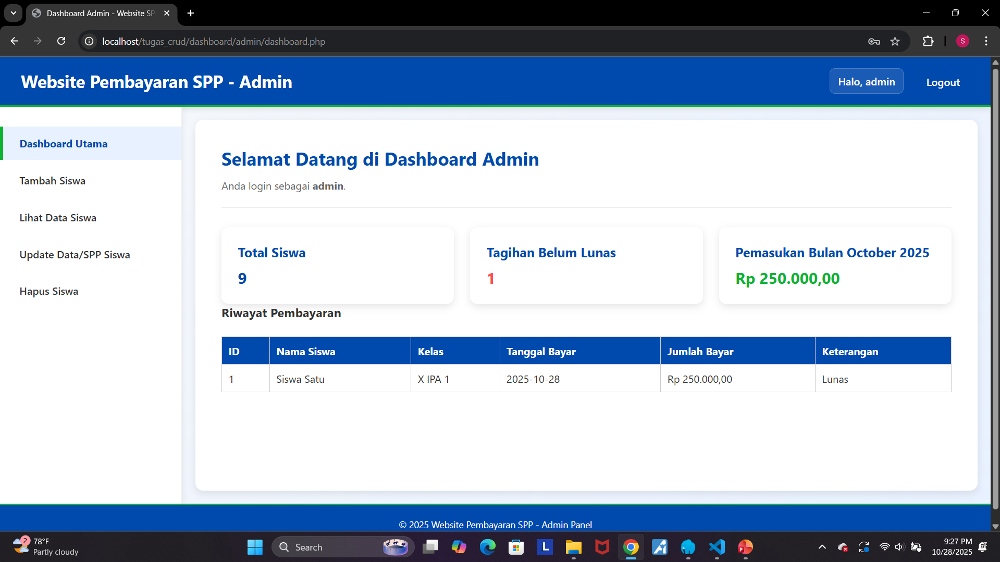
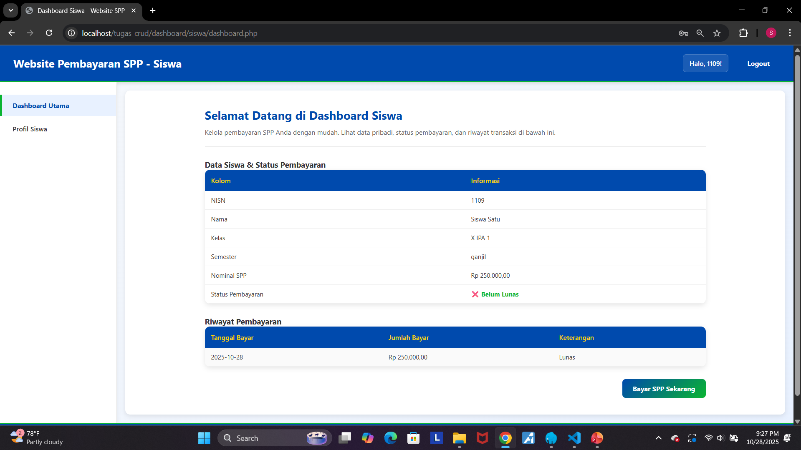

# Website Pembayaran SPP (Sistem Informasi Pembayaran Sekolah)

Website Pembayaran SPP adalah aplikasi web berbasis **PHP native (PHP 8)** yang berfungsi untuk mengelola data siswa dan transaksi pembayaran SPP sederhana.  
Proyek ini dibangun dengan konsep **full-stack sederhana** yang menerapkan fungsionalitas **CRUD (Create, Read, Update, Delete)** untuk data siswa dan pembayaran, serta memiliki sistem login multi-role (Admin & Siswa).

---

### Dibuat Oleh:
**Kelas:** Informatika A 2024  
**Nama:** Syafiq Hafizh Farizi  
**NIM:** 2409106009  

---

## Fitur Tersedia

Aplikasi ini mencakup seluruh spesifikasi utama untuk sistem manajemen pembayaran SPP sekolah:

### Autentikasi
- Sistem **Login & Logout** dengan **PHP Session**.
- Mendukung dua peran pengguna: **Admin** dan **Siswa**.
- Halaman admin & siswa dilindungi dari akses langsung tanpa sesi login.
- Logout aman menggunakan `session_destroy()`.
- Untuk ADMIN login dengan user "admin" dan password "admin123" dan untuk SISWA user "1109" dan password "siswa123"

### CRUD Data Siswa
- **Create:** Tambah data siswa baru (tambahdata.php).  
- **Read:** Lihat dan cari data siswa (lihatdata.php) lengkap dengan kolom pencarian.  
- **Update:** Edit data siswa & status SPP (updatedata.php) lengkap dengan kolom pencarian.  
- **Delete:** Hapus data siswa secara permanen (hapusdata.php) dengan konfirmasi JavaScript.

### READ Data Pembayaran SPP
- Admin dapat melihat data pembayaran terbaru pada dashboard.
- Tabel pembayaran terhubung langsung dengan tabel siswa.

### Fitur Siswa
- Halaman dashboard pribadi menampilkan nama, NISN, kelas, semester, dan status pembayaran.
- Riwayat pembayaran ditampilkan secara rapi dalam tabel.
- Profile siswa

### Keamanan
- Semua query menggunakan **PDO Prepared Statements** (anti SQL Injection).  
- Seluruh data output difilter dengan `htmlspecialchars()` (anti XSS).  
- Password disimpan menggunakan `password_hash()` dan diverifikasi dengan `password_verify()`.  
- Validasi format input (termasuk NISN & nominal).  
- Penanganan kesalahan menggunakan `try...catch` tanpa menampilkan stack trace.

### User Interface
- Tampilan dashboard modern dengan layout sidebar.
- Tabel data responsif dan rapi.
- Pesan sukses & error ditampilkan secara elegan.
- Konfirmasi hapus menggunakan pop-up `confirm()`.

---

## Kebutuhan Sistem

| Komponen | Rekomendasi |
|-----------|--------------|
| PHP | ≥ 8.0 |
| MySQL | ≥ 5.7 |
| Local Server | Laragon / XAMPP |


---

## Cara Instalasi dan Konfigurasi

1. Clone atau Download Proyek
```bash
git clone https://github.com/username/website-spp.git 
```

2. Start server lokal dan Buat databse
- Bisa start dengan laragon atau XAMPP
- Buat database dengan nama tes_spp

```sql
CREATE DATABASE tes_spp;
USE tes_spp;

CREATE TABLE user (
    id INT NOT NULL AUTO_INCREMENT,
    username VARCHAR(50) NOT NULL,
    password VARCHAR(255) NOT NULL,
    role ENUM('admin', 'siswa') NOT NULL,
    PRIMARY KEY (id),
    UNIQUE KEY uni_username (username)
);

CREATE TABLE siswa (
    id INT NOT NULL AUTO_INCREMENT,
    nisn VARCHAR(12) NOT NULL,
    nama VARCHAR(100) NOT NULL,
    tanggal_lahir DATE NOT NULL,
    tempat_lahir VARCHAR(50) NOT NULL,
    kelas VARCHAR(20) NOT NULL,
    semester ENUM('ganjil', 'genap') NOT NULL,
    nominal_spp DECIMAL(10, 2) NOT NULL,
    status_pembayaran ENUM('lunas', 'belum_lunas') NOT NULL,
    created_at DATETIME NULL DEFAULT CURRENT_TIMESTAMP,
    PRIMARY KEY (id)
);

CREATE TABLE pembayaraan (
    id INT NOT NULL AUTO_INCREMENT,
    siswa_id INT NOT NULL,
    tanggal_bayar DATE NOT NULL,
    jumlah_bayar DECIMAL(15, 2) NOT NULL,
    keterangan VARCHAR(255) NULL,
    PRIMARY KEY (id)
);

ALTER TABLE pembayaraan
ADD CONSTRAINT fk_pembayaraan_ke_siswa
FOREIGN KEY (siswa_id) REFERENCES siswa(id)
ON DELETE RESTRICT ON UPDATE CASCADE;

INSERT INTO user (username, password, role) VALUES
('admin', SHA2('admin123', 256), 'admin'),
('siswa1', SHA2('siswa123', 256), 'siswa');

SELECT * FROM user;

INSERT INTO siswa 
(nisn, nama, tanggal_lahir, tempat_lahir, kelas, semester, nominal_spp, status_pembayaran)
VALUES 
('1109', 'Siswa Satu', '2008-05-15', 'Jakarta', 'X IPA 1', 'ganjil', 250000, 'lunas');

INSERT INTO user (username, password, role)
VALUES ('1109', SHA2('siswa123', 256), 'siswa');
```
3. Coba Aplikasi Pada Browser 
Untuk mencoba, buka melalui browser: [http://localhost/tugas_crud/](http://localhost/tugas_crud/)

4. AKUN LOGIN
- Admin = user "admin" password "admin123"
- Siswa = user "1109" password "siswa123"

---

## Struktur Folder Pembayaran SPP

```bash
tugas_web_crud_php_native/
├── about/
│   ├── about.css
│   └── about.php
│
├── dashboard/
│   ├── admin/
│   │   ├── admin_dashboard.css
│   │   └── dashboard.php
│   │
│   └── siswa/
│       ├── bayar/
│       │   ├── bayar.css
│       │   └── bayar.php
│       ├── dashboard.css
│       ├── dashboard.php
│       └── profile.php
│
├── database/
│   └── tes_spp.sql
│
├── hapusdata/
│   ├── hapusdata.css
│   └── hapusdata.php
│
├── image/
│   └── foto/
│
├── lihatdata/
│   ├── detail.css
│   ├── detail.php
│   ├── lihat.css
│   └── lihatdata.php
│
├── login/
│   ├── login.css
│   └── login.php
│
├── tambahdata/
│   ├── tambahdata.css
│   └── tambahdata.php
│
├── updatedata/
│   ├── updatedata.css
│   └── updatedata.php
│
├── index.php
├── koneksi.php
├── logout.php
├── README.md
├── script.js
└── style.css
```

---

## Contoh Environment CONFIG
```php
$host = 'localhost';
$dbname = 'tes_spp';
$username = 'root';
$password = '';
```

---

## Screnshoot Aplikasi SPP
Tampilan Halaman Login  


Tampilan Dashboard Admin  


Tampilan Dashboard Siswa  
